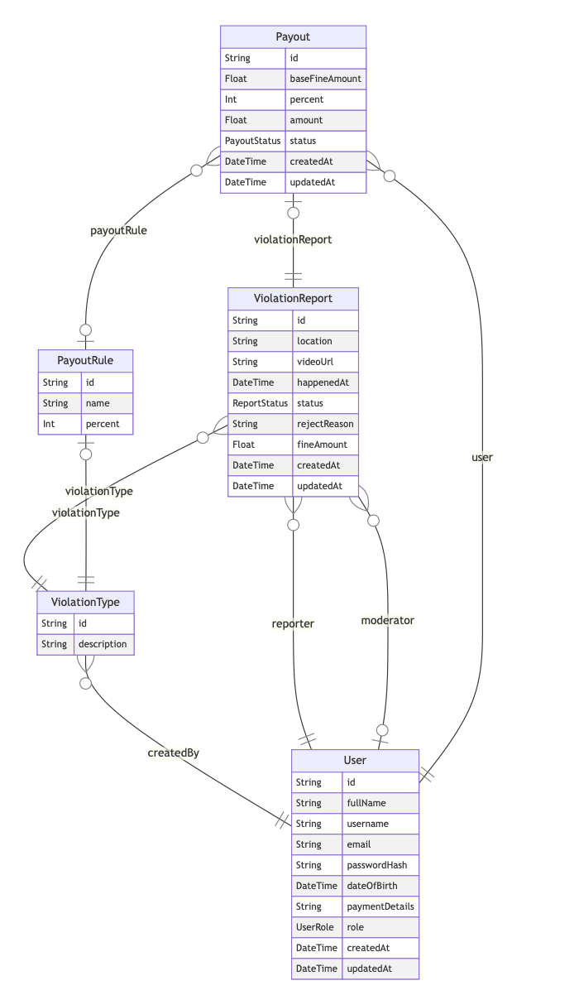

## Тема: pdd-service — backend API

### Предметная область

Система позволяет пользователям фиксировать нарушения ПДД, отправлять заявки на модерацию и потенциально получать процент от выписанного штрафа после подтверждения нарушения.

### Основной сценарий

1. Пользователь регистрируется и авторизуется.
2. Пользователь создаёт заявку о нарушении ПДД.
3. К заявке прикрепляется видео:
   - внешней ссылкой;
   - либо через загрузку файла в S3.
4. Пользователь отправляет заявку на модерацию.
5. Модератор берёт заявку в работу.
6. Модератор подтверждает или отклоняет заявку.
7. Если заявка подтверждена, по правилу выплат может быть рассчитана выплата пользователю.

### ERD:

